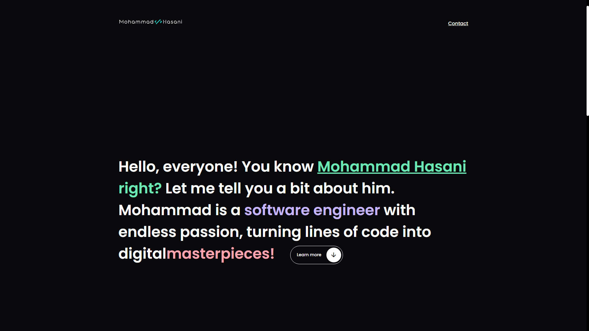

# Personal-Landing: MohammadHasani

New template with a new design written with the Astro framework. 🧑‍🚀
Version 2.0.0

```sh
git clone https://github.com/mohammadhasanii/Personal-Landing
```

**Demo:** [Preview](https://mohammadhasanii.ir)

## 🧞 Commands

All commands are run from the root of the project, from a terminal:

| Command                   | Action                                           |
| :------------------------ | :----------------------------------------------- |
| `npm install`             | Installs dependencies                            |
| `npm run dev`             | Starts local dev server at `localhost:4321`      |
| `npm run build`           | Build your production site to `./dist/`          |
| `npm run preview`         | Preview your build locally, before deploying     |
| `npm run astro ...`       | Run CLI commands like `astro add`, `astro check` |
| `npm run astro -- --help` | Get help using the Astro CLI                     |

